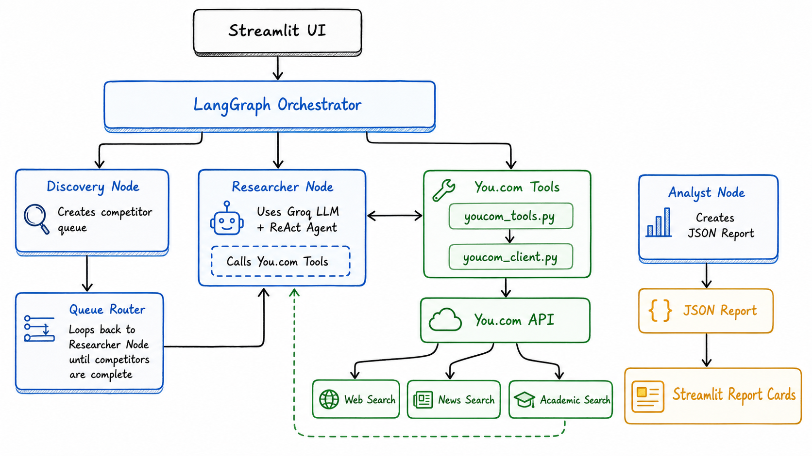

# Market Research AI Agent

An AI-powered autonomous market research tool built with LangGraph, LangChain, Groq, and the you.com Search/News APIs. Given a target company or product name, an orchestrator agent manages an iterative research loop—discovering competitors, gathering raw web and news data, and delegating extraction to a structured LLM analyst. Findings are returned to a Streamlit UI, which renders professional, detailed competitor analysis cards.

This project demonstrates the power of cyclic, state-driven agentic workflows over traditional linear LLM pipelines, utilizing StateGraphs, iterative queue routing, and strict Pydantic schemas for UI reliability.

## Architecture



## This is an agentic system, not a sequential pipeline

The most important concept to understand about this project: **the orchestrator manages a dynamic queue rather than a fixed sequence.** A traditional sequential pipeline for this task would look like: `search for 3 companies → search for all their data at once → send one massive prompt to the LLM to summarize`. That shape is brittle, leads to context-window bloat, and causes the LLM to hallucinate or mix up competitor features.

Instead, this system is **agentic**. It maintains a "short-term memory" (`ResearchState`) and loops based on the length of a `competitor_queue`. The agent isolates its focus, handling exactly one competitor at a time through dedicated research and analysis steps, looping back until the queue is empty. 

**Pro:** Highly accurate, isolated data extraction with zero cross-contamination between competitors. **Con:** Requires careful state management (reducers) to ensure data from earlier loops isn't overwritten.

## Project layout

```text
Market Research Agent/
├── app.py                      # Streamlit UI & LangGraph Orchestrator — the only entrypoint
├── youcom_client.py            # Direct httpx calls to the you.com Search & News APIs
├── youcom_tools.py             # LangChain tool wrappers around youcom_client
├── architecture.png            # The architecture diagram
├── requirements.txt            # All Python dependencies
└── .env                        # Environment variables (Groq + you.com API Keys)

```

## Components explained

### The orchestrator (`app.py`)

The orchestrator is built using LangGraph's `StateGraph`. It manages the `ResearchState` (a `TypedDict`) which persists information across the different nodes. It acts as the central hub, merging the partial dictionaries returned by each specialized node into the global state.

### you.com integration (`youcom_client.py`, `youcom_tools.py`)

`youcom_client.py` wraps the you.com Search (`/search`) and News (`/news`) endpoints with `httpx`, authenticating via the `X-API-Key` header and parsing each response into a flat list of `{title, url, snippet}` dicts. `youcom_tools.py` exposes those calls as LangChain `@tool` functions (`youcom_web_search`, `youcom_news_search`) that format results into a plain-text block for the LLM, and are invoked directly from the graph nodes below.

### Nodes — specialist workers

The graph consists of three primary nodes:

**`discovery_node`** — Runs once per session. Takes the target company and uses `youcom_web_search` to find the top 3 *specific product-level* competitors. It populates the `competitor_queue` state.

**`researcher_node`** — Runs once per competitor. Iterates through the queue by popping the next target. It calls `youcom_web_search` for pricing/features/positioning and `youcom_news_search` for recent announcements, then combines both into one raw data blob.

**`analyst_node`** — Runs once per competitor. Takes the unstructured web+news blob from the Researcher and passes it through the Groq LLM using `.with_structured_output()`. It acts as an elite market analyst to extract validated insights into a clean JSON format.

### The Queue Router (Conditional Edge)

This is where the agentic loop lives. After the Analyst node finishes, the `queue_router` checks the `competitor_queue`. If competitors remain, it loops the state back to the `researcher_node`. If the queue is empty, it routes to `END`, releasing the final data to the UI.

### Structured output and Reducers

The end goal of the orchestrator is a list of `CompetitorReport` objects (defined via Pydantic).

Because the graph loops over the Analyst node multiple times, returning a standard dict would overwrite the previous reports. To solve this, the `final_reports` field in the state is annotated with the `operator.add` reducer. This tells LangGraph to safely append the new Pydantic report to the existing list during every cycle, ensuring the UI receives a complete array of all competitors.

### Anti-Hallucination Prompts

Because web scraping is unpredictable, the Analyst node's system prompt includes a strict constraint: *"If you cannot find a specific detail in the text, write 'Data not found'."* This explicit permission to admit ignorance prevents the LLM from inventing pricing tiers or features that don't exist.

## End-to-end run flow

This is what happens when a user clicks **Run Research Pipeline** in the UI:

1. **UI form submit** — User enters a company name and triggers the graph.
2. **Setup** — `app.py` reads the `.env` file, initializes the `ChatGroq` client, and compiles the `StateGraph`.
3. **Discovery** — The `discovery_node` scans the web and identifies 3 competitors, adding them to the state's `competitor_queue`.
4. **Research Loop Starts** — The `researcher_node` pops the first competitor and fetches raw HTML/text data about their pricing and features.
5. **Analysis** — The `analyst_node` parses the raw data into a strictly typed `CompetitorReport` JSON object and appends it to `final_reports`.
6. **Routing** — The `queue_router` checks the queue. Seeing 2 competitors left, it loops back to step 4.
7. **Graph Ends** — Once the queue is at 0, the router exits the graph and returns the final state to Streamlit.
8. **UI Rendering** — Streamlit unpacks `final_reports` and renders professional, multi-column expander cards for each competitor.

## How to run

### Prerequisites

* Python 3.10+
* A [Groq API Key](https://console.groq.com/keys) (Free tier is sufficient)
* A [you.com API Key](https://api.you.com/) for the Search/News endpoints

### Configuration

Create a `.env` file in the root directory and add your keys:

```text
GROQ_API_KEY=gsk_your_api_key_here
YOUCOM_API_KEY=your_youcom_api_key_here

```

### Launch

Install the dependencies and start the Streamlit server:

```bash
pip install streamlit langchain-groq langgraph pydantic langchain-core httpx python-dotenv
streamlit run app.py

```

The browser will open to `http://localhost:8501`. Enter a well-known tech product (e.g., "Anthropic Claude") and click **Run Research Pipeline** to watch the agentic loop in action.
# Market-Research-Agent--You.com
